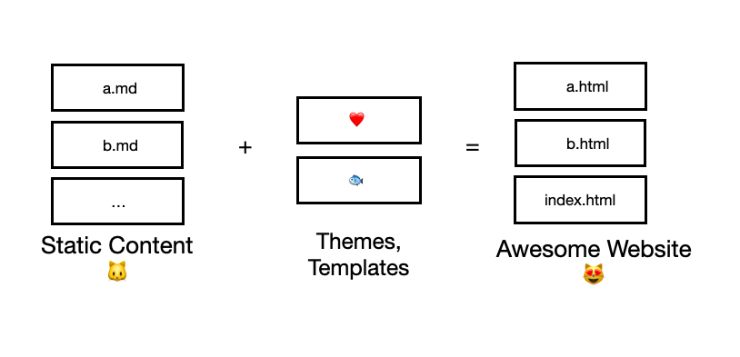

# Understanding the Build Loop of a Static Site Generator with Abell 🌀


If you are intermediate into programming, learning how Static Site Generators work behind-the-scenes is one of those challenges which are really interesting and test your programming skills with a language in depth.

Before we get into the guts of it, lets give a brief introduction to Static Site Generators, or SSGs. SSGs are basically tools which take your:

1. Static Content,
2. Set of themes or Templates,

and provide you with a static, production-ready website just like this one 😉.



## Introduction

To understand how SSGs do this, we’ll be looking at [AbellJS](https://github.com/abelljs/abell) in particular, which is a Static Site Generator which allows you to use vanilla JS and HTML with minimal new syntax that the developer has to learn ( just \{\{ }} around the JS you want to execute ).

Firstly, let’s go to [https://github.com/abelljs/abell](https://github.com/abelljs/abell) to check out their README and examples. You can clone the repository locally and run `npm i` to get started.

Currently, since the generator isn’t intended for use in production, you can run `npm run dev:build` to build a static version of your website.

By taking a peek at the `package.json`, we see that this piece of code is being called

```bash
cd demo && node ../src/index.js build
```

If you follow its trail, through a function call in `commander`, you will finally end up at this function : [https://github.com/abelljs/abell/blob/e5f02829a7cafcfc9bf57b929b6940da055afefe/src/action.js#L35](https://github.com/abelljs/abell/blob/e5f02829a7cafcfc9bf57b929b6940da055afefe/src/action.js#L35) .

To understand this code we first need to know what Abell does. If you check the `demo` folder, it contains 3 things :

1. A `content` folder containing all the static assets and data for the final site.
2. A `theme` folder containing all the `.abell` files which are used for theming your website.
3. An `abell.config.js` file containing the config for your website (themes source folder, destination folder, and content folder).

## Understanding the Build Loop

 We will understand the responsibilities and effects of the build function as we move through the code.

```jsx
if (programInfo.logs == 'complete') console.log('\n>> Abell Build Started\n');
```

This line signals that the build has started. After that we get :

```jsx
const abellFiles = getAbellFiles(
  programInfo.abellConfigs.sourcePath,
  '.abell'
);
```

The `getAbellFiles` function is pretty straightforward. We get all the files with the `.abell` extension from the source path which has been mentioned in the config.

The lines following this refresh the destination folder for a new build.

```jsx
rmdirRecursiveSync(programInfo.abellConfigs.destinationPath);
fs.mkdirSync(programInfo.abellConfigs.destinationPath);
```

We also copy over all the static files from the `themes` folder, in case any, except for the `.abell` files

```jsx
copyFolderSync(
  programInfo.abellConfigs.sourcePath,
  programInfo.abellConfigs.destinationPath,
  ignoreCopying
);
```

The next loop is responsible for rendering all the pages in your content folder.

```jsx
for (const contentSlug of programInfo.contentDirectories) {
  generateContentFile(contentSlug, programInfo);
  if (programInfo.logs == 'complete') console.log(`...Built ${contentSlug}`);
}
```

To understand what `generateContentFile` does, check out this page : [https://github.com/abelljs/abell/blob/e5f02829a7cafcfc9bf57b929b6940da055afefe/src/content-generator.js#L244](https://github.com/abelljs/abell/blob/e5f02829a7cafcfc9bf57b929b6940da055afefe/src/content-generator.js#L244). The code is pretty straightforward and will give you a hang of how rendering is done in Abell.

The next loop consists of the second set of rendering in Abell.

```jsx
for (const file of abellFiles) {
  const relativePath = path.relative(
    programInfo.abellConfigs.sourcePath,
    file
  );

  if (relativePath.includes('[$slug]')) {
    continue;
  }

  // e.g generateHTMLFile('index', programInfo) will build theme/index.abell to dist/index.html
  generateHTMLFile(relativePath, programInfo);

  if (programInfo.logs == 'complete') {
    console.log(`...Built ${relativePath}.html`);
  }
}
```

For any other `.abell` other than the content themes (stored in [#slug]), another rendering loop takes place, where a different function is used this time : [https://github.com/abelljs/abell/blob/f926a627b348040d2209ec3d65b68c7e7c389a21/src/content-generator.js#L169](https://github.com/abelljs/abell/blob/f926a627b348040d2209ec3d65b68c7e7c389a21/src/content-generator.js#L169). 

This function is a bit different and more complex, building the head elements with stylesheet and script imports first, before rendering it with the `abellRenderer`.

After this function finishes successfully, that’s about it. The build loop has completed successfully and you should have your static website ready at `dist`.

## Conclusion

That's it ! Now you host this static website on a solution like [Netlify](https://netlify.com) and you're done 😁 ! Thanks for reading this blog ! To learn more, you can click on one of the links below. Subscribe if you feel like I helped you :)

- [https://github.com/abelljs/abell](https://github.com/abelljs/abell)
- [https://www.netlify.com/blog/2020/04/14/what-is-a-static-site-generator-and-3-ways-to-find-the-best-one/](https://www.netlify.com/blog/2020/04/14/what-is-a-static-site-generator-and-3-ways-to-find-the-best-one/)